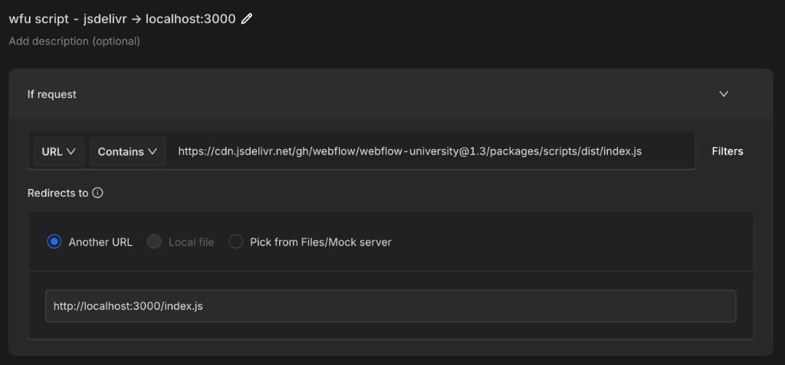

# Webflow University

`webflow-university` is a pnpm monorepo with 2 packages:

- `packages/scripts`: TypeScript that builds to browser JavaScript files loaded on Webflow University pages through jsdelivr or a local dev redirect.
- `packages/code-components`: React-based Webflow Code Components that are developed locally with Vite and shared into Webflow with the Webflow CLI.

> Critical code that depends on user auth state or backend features, such as course progress, is managed in the private [`webflow/webflow`](https://github.com/webflow/webflow/) monorepo.

## Package Scripts

### `packages/scripts`

The scripts package builds 3 browser bundles into `packages/scripts/dist`.

- `dist/index.js` is the main Webflow University script. It initializes sidebar behavior, sidebar active-link highlighting, theme switching, contrast switching, global search behavior, and the `/courses` grid/list UI.
- `dist/pro/index.js` is used on Pro event listing pages. It reads recurrence data from CMS-rendered data attributes, calculates the next event occurrence, updates date/time text, supports a user-timezone toggle, and enables horizontal session-tab scrolling.
- `dist/pro/template-page.js` is used on Pro template/detail pages. It reads session recurrence data from `#data-saver`, renders upcoming session dates and registration links, and enables horizontal session-tab scrolling.

Use these files from jsdelivr in Webflow, for example:

```html
<script
  defer
  src="https://cdn.jsdelivr.net/gh/webflow/webflow-university@1.3/packages/scripts/dist/index.js"
></script>
```

### `packages/code-components`

The code-components package contains Webflow Code Components for richer UI that is easier to build in React than directly in Webflow. Current components include Autoplay Tabs, WFU CMS Calendar, and ProSphere.

Share components to Webflow with:

```bash
pnpm share:components
```

## Common Commands

### Install

```bash
pnpm install
```

### Dev

```bash
# Serve the scripts package from http://localhost:3000 with live reload
pnpm dev:scripts

# Run the code-components Vite dev server
pnpm dev:components
```

### Build

```bash
# Build all packages
pnpm build

# Build one package
pnpm build:scripts
pnpm build:components
```

### Changeset

Create a changeset when your change should be released:

```bash
pnpm changeset
```

Then follow the prompts to choose the changed package and version bump type. Commit the generated `.changeset/*.md` file with your PR.

### Deploy To Main

1. Open a PR into `main`.
2. Make sure CI passes: tests, lint, type check, and build.
3. Merge the PR.
4. If the PR included a changeset, GitHub Actions opens a version PR.
5. Merge the version PR to create the GitHub release and make the scripts available from jsdelivr.
6. Update the script URL inside Webflow if the release includes a major or minor version change. Patch changes are picked up automatically; to force a patch update sooner, purge the jsDelivr cache at [jsdelivr.com/tools/purge](https://www.jsdelivr.com/tools/purge).

## QA: How To Test Your Changes

### Scripts

The main way to QA scripts is to run the local dev bundle and redirect the jsdelivr URL to localhost with a redirect service like [Requestly](https://requestly.com/).

1. Start the local scripts server:

   ```bash
   pnpm dev:scripts
   ```

2. In Requestly, create a redirect rule from the jsdelivr script URL to the matching localhost bundle.

   Example for the main script:
   - From: `https://cdn.jsdelivr.net/gh/webflow/webflow-university@1.3/packages/scripts/dist/index.js`
   - To: `http://localhost:3000/index.js`

   

3. Open the relevant Webflow University page and verify the behavior in the browser.

For Pro bundles, redirect to the matching local file:

- `packages/scripts/dist/pro/index.js` -> `http://localhost:3000/pro/index.js`
- `packages/scripts/dist/pro/template-page.js` -> `http://localhost:3000/pro/template-page.js`

You can also QA scripts with Chrome local overrides instead of Requestly.

### Code Components

Run the component dev server, test the component locally, then share it to Webflow when ready:

```bash
pnpm dev:components
pnpm share:components
```

## Checks Before Opening A PR

```bash
pnpm test
pnpm lint
pnpm check
pnpm build
```
